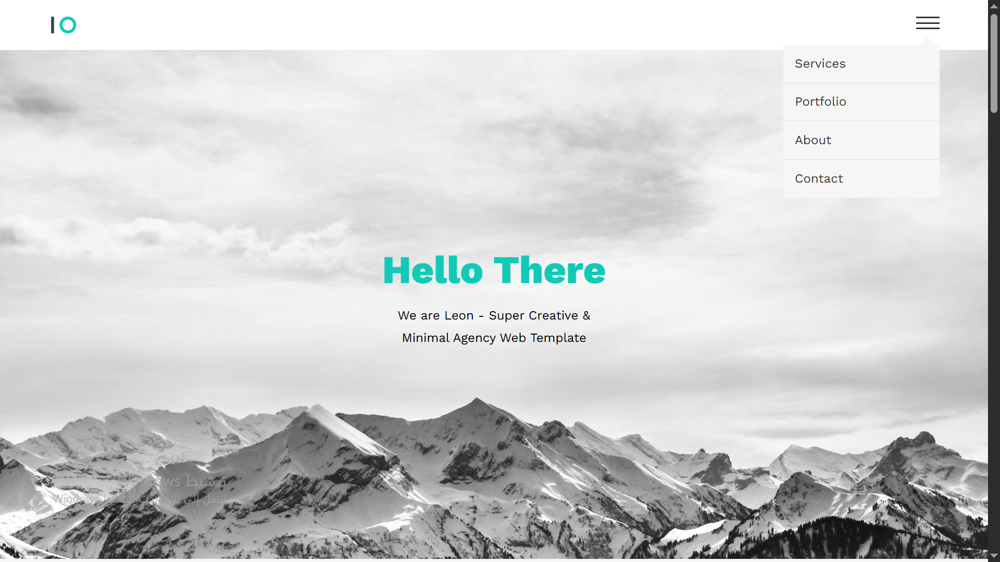

# Leon — Personal Portfolio
A clean and simple single-page personal website for Leon showcasing services, portfolio/gallery, and an about section. Built with HTML and CSS.

## Screenshot


## Features
- Single-page layout with sections: Home, Services, Portfolio (Gallery), About, Contact
- Responsive design for mobile and desktop
- Clean, minimal aesthetic focused on readability and presentation
- Easy-to-update project/portfolio cards

## Built With
- HTML5
- CSS3 (Flexbox / Grid)

## What I Learned
- Structuring a personal portfolio
- Responsive layout techniques
- Organizing content for a personal brand

## How To Run Locally
```bash
git clone https://github.com/YOUR_GITHUB_USERNAME/leon-portfolio.git
cd leon-portfolio
open index.html